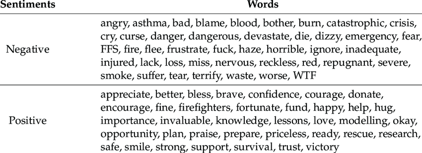

By Group "Five Sigma"


# Sentiment Score 

To construct an appropriate measurement that reflects the sentimental information behind FOMC minutes, and then makes predictions about the interest rate fluctuation indirectly, we plan to try 2 optional methods - **CNN(Convolutional Neural Networks)** and **TextBlob**, both of which can return to a float number showing the sentimental tendency of the Federal Reserve on interest rate policy.

We will share our insights and provide corrersponding examples in followings.

## Option 1: CNN

Convolutional Neural Networks (CNNs) are a class of **deep neural networks** commonly used for analyzing visual imagery. They are designed to automatically and adaptively learn **spatial hierarchies of features** from the input data. However, instead of its traditional application in image recognition, we take its advantage that it can learn some difficult structures embedded in input data more accurately, so that we can quantitatively learn how possible the Federal Reserve will increase the policy rate next period by 'deep learning' FOMC texts and their sentimental structures. 

Typically, the CNN algorithm mainly contains following steps:

    1. Word Embeddings: Convert each word in the sentence into its word embedding representation, which captures semantic and contextual information.

    2. Padding: Since sentences may have different lengths, padding can be used to make all input sequences of equal length.
    
    3. Convolutional Layers: These layers apply convolution operations to the input, using filters that detect specific features in the input data. The filters slide over the input data to capture patterns.

    4. Pooling Layers: Pooling layers down-sample the feature maps generated by the convolutional layers, reducing the spatial dimensions of the data while retaining important information.

    5. Activation Functions: Non-linear activation functions like ReLU (Rectified Linear Unit) introduce non-linearities to the network, enabling it to learn complex patterns in the data.

    6. Fully Connected Layers: These layers connect every neuron in one layer to every neuron in the next layer, helping to classify the features extracted by earlier layers.
    
These codes briefly introduce a framework of CNN and its application in sentimental analysis:

```python
import numpy as np
from keras.models import Sequential
from keras.layers import Embedding, Conv1D, GlobalMaxPooling1D, Dense

# Example data
sentences = ["I loved the NLP!", "The result was terrible.", "The method was average."]
labels = [1, 0, 0]  # 1 for positive sentiment, 0 for negative sentiment

# Preprocess the data
vocab_size = 10000  # Size of the vocabulary
max_length = 20  # Maximum length of input sentences

# Tokenize the sentences and pad them to a fixed length
tokenizer = Tokenizer(num_words=vocab_size)
tokenizer.fit_on_texts(sentences)
sequences = tokenizer.texts_to_sequences(sentences)
padded_sequences = pad_sequences(sequences, maxlen=max_length)

# Create the CNN model
embedding_dim = 100  # Dimension of word embeddings
num_filters = 128  # Number of filters in convolutional layer

model = Sequential()
model.add(Embedding(vocab_size, embedding_dim, input_length=max_length))
model.add(Conv1D(num_filters, 5, activation='relu'))
model.add(GlobalMaxPooling1D())
model.add(Dense(1, activation='sigmoid'))

# Compile the model
model.compile(optimizer='adam', loss='binary_crossentropy', metrics=['accuracy'])

# Train the model
model.fit(padded_sequences, np.array(labels), epochs=10, batch_size=32, validation_split=0.2)

# Make predictions
test_sentences = ["The movie was great!", "I didn't enjoy it."]
test_sequences = tokenizer.texts_to_sequences(test_sentences)
padded_test_sequences = pad_sequences(test_sequences, maxlen=max_length)
predictions = model.predict(padded_test_sequences)

# Print the predictions
for i, sentence in enumerate(test_sentences):
    sentiment = "positive" if predictions[i] > 0.5 else "negative"
    print(f"Sentence: {sentence}")
    print(f"Sentiment: {sentiment}")
```

In this example, we use the **Keras library** to build a CNN model for sentiment analysis. We tokenize the input sentences, pad them to a fixed length, and then define the model architecture using the Embedding, Conv1D, GlobalMaxPooling1D, and Dense layers. We compile the model with an optimizer, loss function, and metrics, and then train it on the labeled data. Finally, we make predictions on new test sentences and print the predicted sentiment.


## Method 2: TextBlob

Another option to explore sentimental tendency is TextBlob, a prepared module in Python. TextBlob originally holds a sentimental semantic classifier, categorizing 'sentimental words' into different labeled groups. When measuring the probability that a certain sentence conveys positive/negative attitude, TextBlob turns to **'Naive Bayes Classifier'** , which assigns input data the predicted state corresponding to the maximum conditional probability given current state. 

Here is the specification of 'Naive Bayes Classifier':

    1. Let  𝒙={𝒂_𝟏,  𝒂_𝟐,  𝒂_𝟑,…,𝒂_𝒏} be a item to be classified, where 𝒂_𝒊 represents a characteristic of 𝒙.

    2. Denote our sentiment labels as 𝒔={𝒔_𝟏,  𝒔_𝟐,  𝒔_𝟑,…,𝒔_𝒎}.

    3. Calculate the conditional probabilities and find the largest one: 

             𝑷(𝒔_𝒌│𝒙)=𝒎𝒂𝒙{𝑷(𝒔_𝟏│𝒙),𝑷(𝒔_𝟐│𝒙),…, 𝑷(𝒔_𝒎│𝒙)}

      then we categorize the item 𝒙 into sentiment label 𝒔_𝒌.


To practically apply TextBlob module, we can just import it and call the **'sentiment.polarity'** function. The following are the demo codes:

```python
from textblob import TextBlob

# Simple function to output sentiment score
def get_sentiment_score(text):
    blob = TextBlob(text)
    sentiment_score = blob.sentiment.polarity
    return sentiment_score

# Example usage
text = "The weather tends to be terrible tomorrow"
sentiment_score = get_sentiment_score(text)
print(sentiment_score)   
```

# Accuracy and Training Set

In order to enhance our model's accuracy when making decisions on relatively long texts, we calculate the mean of TextBlob sentiment score of each sentence in an article, so that the final result become more comprehensive and smoothier.

The code we use is as follows:

```python
sentiment_list = []  

# text_list contains all articles to be analyzed.
for text in text_list:
    sub_sentiment_list = []
    for sentence in text:
        blob = TextBlob(sentence)
        sentiment_score = blob.sentiment.polarity
        sub_sentiment_list.append(sentiment_score)
    sentiment_list.append(sub_sentiment_list.mean())
```

On the other hand, default sentiment classifier may not fit enough in the context of interest rate policies.\
The prediction system will perform better if we can insert our own training set that maps the Federal Reserve’s statements on interest rate policies to several custom labels.

##### Traditional Sentimental Words Classification


##### A Word Cloud relating to Interest Rate Policy


